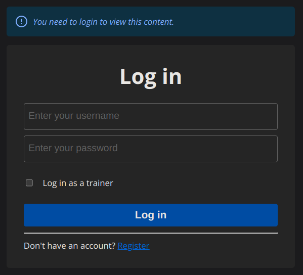
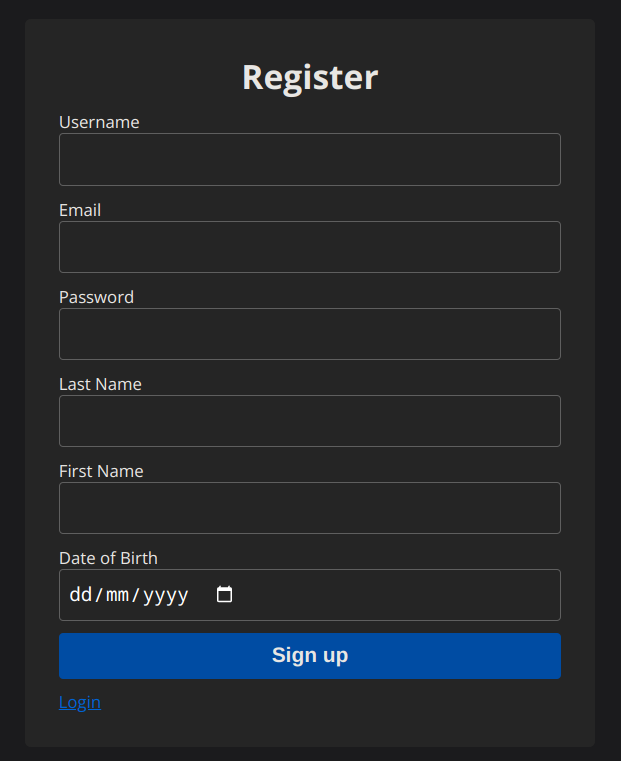
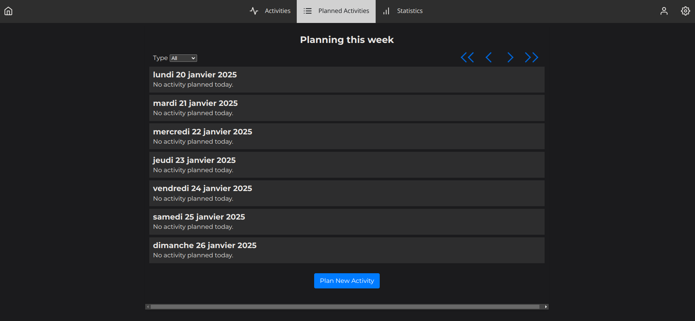

# TrackRun

Application pour le suivi de l’activité physique entre l’entraîneur et le client. (Complété dans le cadre du Projet Pilote INM5151 et INF6150 de l'UQAM 2024)

## Lancer l'application

Backend: Référez-vous à [backend/README.md](backend/README.md)

Frontend: Référez-vous à [frontend/README.md](frontend/README.md)

## Apperçu de l'apparences général

